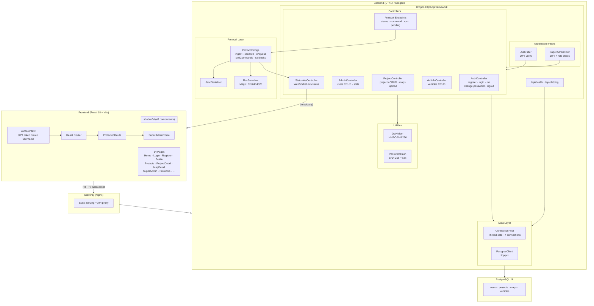
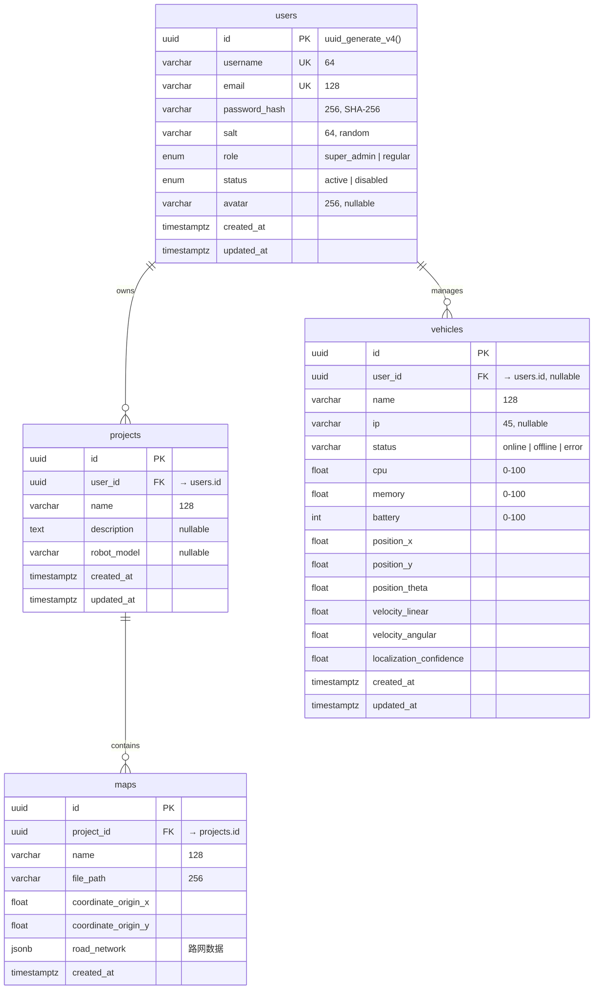

# ROC-SYSTEM

Robot Operation Control Platform — 机器人运营控制平台

**C++17 / Drogon REST + WebSocket 后端 · React 18 / TypeScript 前端 · PostgreSQL 数据层 · Docker Compose 部署**

## 架构总览



## 技术栈

| 层 | 技术 | 版本 | 用途 |
|---|---|---|---|
| 前端框架 | React + TypeScript | 18.3 / 5.9 | SPA 页面组件 |
| 构建工具 | Vite | 6.3.5 | 开发服务器 + 生产构建 |
| CSS | Tailwind CSS | v4 | 原子化样式 |
| UI 组件库 | shadcn/ui (Radix + Lucide) | — | 49 个可访问组件 |
| 图表 | Recharts | 2.15 | 性能监控图表 |
| 路由 | React Router DOM | v6 | 客户端路由 + 守卫 |
| 后端框架 | Drogon | v1 | 非阻塞 HTTP + WebSocket |
| 语言标准 | C++17 | — | 后端业务逻辑 |
| 数据库驱动 | libpqxx | v6 | PostgreSQL C++ 客户端 |
| JSON | jsoncpp | — | JSON 解析与序列化 |
| 加密 | OpenSSL | — | HMAC-SHA256 / SHA-256 |
| 数据库 | PostgreSQL | 16+ | 关系型数据库 |
| 容器化 | Docker + Compose | 3.9 | 三服务编排 |
| 网关 | Nginx | — | 静态服务 + 反向代理 |

## 项目结构

```
ROC-SYSTEM/
├── docker/
│   ├── backend/Dockerfile          # 多阶段 C++ 编译 (CMake + make)
│   ├── frontend/Dockerfile          # 多阶段 Node + Nginx
│   ├── frontend/nginx.conf          # SPA fallback + API proxy
│   ├── postgres/Dockerfile          # 时区 + 中文 locale
│   └── compose/
│       ├── docker-compose.yml       # postgres + backend + frontend
│       └── .env.example             # 环境变量模板
├── postgres/init/
│   └── init.sql                     # Schema: users · projects · maps · vehicles
├── roc-backend/
│   ├── CMakeLists.txt               # C++17 · Drogon · libpqxx · OpenSSL · jsoncpp
│   └── src/
│       ├── main.cpp                 # 入口：配置加载 → 连接池 → 路由注册 → 启动
│       ├── config/
│       │   └── AppConfig.{h,cpp}    # 环境变量解析 (HTTP / DB / JWT)
│       ├── controllers/
│       │   ├── AuthController.{h,cpp}      # register · login · me · change-password · logout
│       │   ├── AdminController.{h,cpp}     # 用户 CRUD · 统计 · 角色权限
│       │   ├── ProjectController.{h,cpp}   # 项目/地图 CRUD · 文件上传
│       │   ├── VehicleController.{h,cpp}   # 车辆注册 · 状态更新 · 删除
│       │   └── StatusWsController.{h,cpp}  # WebSocket 连接管理 · 广播
│       ├── middleware/
│       │   └── AuthMiddleware.{h,cpp}      # AuthFilter · SuperAdminFilter
│       ├── models/
│       │   └── User.h                      # 用户数据模型
│       ├── db/
│       │   ├── PostgresClient.{h,cpp}      # SQL 执行 (query/execute/insertReturning)
│       │   └── ConnectionPool.{h,cpp}      # 线程安全连接池 (4 连接)
│       ├── protocols/
│       │   ├── common/types.h              # ProtocolType · MessageType · RobotStatus · ControlCommand
│       │   ├── ProtocolSerializer.h        # IProtocolSerializer 抽象接口
│       │   ├── JsonSerializer.{h,cpp}      # JSON ↔ RobotStatus / ControlCommand
│       │   ├── RocSerializer.{h,cpp}       # ROC binary ↔ RobotStatus / ControlCommand
│       │   ├── ProtocolBridge.{h,cpp}      # 消息路由 · 回调 · 指令队列
│       │   └── roc/
│       │       ├── README.md               # ROC 协议规范文档
│       │       └── roc_bridge.cpp          # HTTP 端点注册 (status/command/roc/pending)
│       └── utils/
│           ├── JwtHelper.{h,cpp}           # JWT 签发与验证 (HMAC-SHA256)
│           ├── PasswordHash.{h,cpp}        # 密码哈希 (SHA-256 + 随机盐)
│           └── AuditLogger.h               # 审计日志工具
├── roc-frontend/
│   ├── index.html
│   ├── package.json                        # React 18 · shadcn/ui · Recharts · Lucide
│   ├── vite.config.ts                      # API 代理 + Tailwind v4
│   └── src/
│       ├── main.tsx                        # React 入口
│       ├── App.tsx                         # AuthContext · Router · ProtectedRoute · SuperAdminRoute
│       ├── index.css                       # 全局样式
│       ├── types/
│       │   └── robot.ts                    # Robot · RobotPosition · RobotVelocity · PathNode
│       ├── styles/
│       │   └── globals.css                 # Tailwind 指令
│       ├── guidelines/
│       │   └── Guidelines.md               # 前端开发指南
│       └── components/
│           ├── HomePage.tsx                # 首页导航 · 功能卡片
│           ├── LoginPage.tsx               # 登录表单
│           ├── RegisterPage.tsx            # 注册表单
│           ├── ProfilePage.tsx             # 个人信息 · 密码修改
│           ├── ProjectsPage.tsx            # 项目列表 CRUD
│           ├── ProjectDetailPage.tsx       # 项目详情 · 地图列表
│           ├── MapDetailPage.tsx           # 统一 SVG 地图 · 实时车辆 · 路网
│           ├── MapUploadModal.tsx          # 地图上传弹窗
│           ├── VehiclePopup.tsx            # 车辆详情悬浮窗
│           ├── PerformanceMonitor.tsx      # 性能监控面板
│           ├── SuperAdminPage.tsx          # 用户管理 · 统计仪表盘
│           ├── ProtocolsPage.tsx           # 协议文档展示
│           ├── PuzzleVerification.tsx      # 拼图验证码
│           ├── figma/
│           │   └── ImageWithFallback.tsx   # 图片加载降级
│           └── ui/                         # 49 个 shadcn/ui 组件
│               ├── accordion · alert-dialog · alert · aspect-ratio
│               ├── avatar · badge · breadcrumb · button
│               ├── calendar · card · carousel · chart · checkbox · collapsible
│               ├── command · context-menu
│               ├── dialog · drawer · dropdown-menu
│               ├── form · hover-card
│               ├── input-otp · input
│               ├── label
│               ├── menubar
│               ├── navigation-menu
│               ├── pagination · popover · progress
│               ├── radio-group · resizable
│               ├── scroll-area · select · separator · sheet · sidebar
│               ├── skeleton · slider · sonner · switch
│               ├── table · tabs · textarea · toggle-group · toggle · tooltip
│               └── use-mobile · utils
├── scripts/
│   ├── deploy-all-docker.sh                # 一键 Docker Compose 编排
│   ├── deploy-all.sh                       # 一键本地部署编排
│   ├── deploy-backend-docker.sh            # 后端 Docker 构建部署
│   ├── deploy-backend.sh                   # 后端本地部署
│   ├── deploy-frontend-docker.sh           # 前端 Docker 构建部署
│   ├── deploy-frontend.sh                  # 前端本地部署
│   ├── deploy-postgres-docker.sh           # PostgreSQL Docker 部署
│   ├── deploy-postgres.sh                  # PostgreSQL 本地部署
│   ├── deploy-gateway.sh                   # Nginx 网关部署
│   ├── lib/common.sh                       # Shell 公共函数库
│   ├── config/
│   │   ├── deploy.env.example              # 部署环境变量模板
│   │   └── secrets.env.example             # 密钥模板
│   └── templates/
│       └── nginx-site.conf.template        # Nginx 站点配置模板
├── .gitignore
├── CHANGELOG.rst                           # 变更日志 (Keep a Changelog)
└── README.md                               # 本文件
```

## 模块调用关系

### HTTP 请求生命周期

```
Browser → Nginx (static or proxy)
  → Drogon HttpAppFramework
    → CORS Preflight? → pass through
    → Route Match: /api/auth/* /api/admin/* /api/projects/* /api/vehicles/* /api/protocol/*
    → Middleware (optional):
        AuthFilter          → JWT Bearer token 校验 → 注入 user_id/username/role 到 request attributes
        SuperAdminFilter    → JWT + role == "super_admin" 校验
    → Controller Handler (lambda)
        → PostgresClient (new connection or pool)
            → libpqxx → PostgreSQL
        → Response (JSON)
    → Client
```

**路由注册模式**：所有路由函数在 `main.cpp` 中以独立函数调用注册（非 Drogon 注解方式），格式为 `roc::controller::registerXxxRoutes(cfg, connStr)`。

### WebSocket 实时推送链

```
Robot System
  → POST /api/protocol/status (JSON + per-vehicle Device token)
    → ProtocolBridge::ingest(data, JSON)
      → JsonSerializer::deserializeStatus()
        → onStatusReport callback (registered in main.cpp)
          → VehicleStatusService validates and persists telemetry/version
          → StatusWsController::broadcastVehicle(vehicle)
            → 仅发送给已认证且订阅该 project_id 的连接
              → VehicleRealtimeProvider 合并版本化事件
                → 更新画布上车辆标记位置/状态
```

### 协议消息路由

```
POST /api/protocol/status  (JSON status)
  → JSON 状态预解析 → Device token/robot_id 校验
  → ProtocolBridge::ingest(JSON) → 持久化遥测 → 项目级 WebSocket 事件

POST /api/protocol/command (JSON command)
  → JSON 指令预解析 → Device token/robot_id 校验
  → ProtocolBridge::enqueueCommand(JSON)

POST /api/protocol/roc     (ROC binary status)
  → STATUS_REPORT 预解析 → Device token/robot_id 校验
  → ProtocolBridge::ingest(ROC) → 持久化遥测 → 项目级 WebSocket 事件

GET /api/protocol/pending/{robot_id}      → ProtocolBridge::pollCommands()
  → 返回并清空该 robot_id 的内存待执行指令队列
```

HTTP 入口会先按其声明格式完成解析和设备授权，再调用协议桥；因此协议桥内部的 serializer fallback 不代表 HTTP 接口可以混传内容类型。当前 `/api/protocol/roc` 只接受 ROC `STATUS_REPORT`，二进制控制帧和心跳尚未开放 HTTP 接入。待执行指令队列不持久化，服务重启后不会保留。

### 前端路由守卫

```
App.tsx → AuthContext (JWT token / role / username → localStorage)
  ├── / · /login · /register · /guide              → 公开路由
  ├── /profile · /projects · /protocols · …         → ProtectedRoute (isLoggedIn)
  └── /admin/users                                    → SuperAdminRoute (isLoggedIn + role=="super_admin")
```

## 数据流

### 认证流

```
Register/Login
  → POST /api/auth/register|login { username, password }
    → 密码哈希: SHA-256(password + 16-byte random salt)
    → JWT 签发: HMAC-SHA256(header.payload, JWT_SECRET)
    → 返回 { token, user: { user_id, username, role } }
  → 前端: localStorage 存储 roc_token / roc_role / roc_username
  → 后续请求: Authorization: Bearer <token>
  → 后端 AuthFilter: 验证 → 注入 user_id/username/role 到 request attributes
```

### 实时状态流

```
Robot reports status (via JSON or ROC HTTP endpoint)
  → 单车 Device token 与 robot_id(UUID) 白名单校验
    → ProtocolBridge::ingest()
    → JsonSerializer/RocSerializer::deserializeStatus() → RobotStatus struct
      → onStatusReport callback
        → 数据库事务更新车辆状态并递增 telemetry_version
        → 仅向订阅车辆所属项目的已认证 WebSocket 客户端推送
          → 前端按 version 合并事件；断线时每 10 秒 REST 轮询兜底
```

### 地图可视化 — 统一 SVG 坐标空间

```
容器尺寸 → ResizeObserver → 矩形 viewport
地图元数据 → worldToMap() → 图片像素坐标
fitScale + zoom + pan → 单一 SVG <g transform>
  ├── 鉴权加载的地图 <image>
  ├── road_network 路网 <line>
  └── 当前地图车辆标记与方向

交互:
  - 光标锚定缩放、pointer capture 平移、适应视图和专注模式
  - 桌面三栏显示车辆列表/地图/详情；窄屏使用车辆选择器和详情浮层
  - 选中状态保存 vehicle ID，详情持续从实时 store 派生
  - 路网导出为 CSV（from_x,from_y,to_x,to_y）
```

## 数据库 Schema



## API 端点

### 健康检查

| 端点 | Method | 认证 | 说明 |
|---|---|---|---|
| `/api/health` | GET | 公开 | 服务存活检查 |
| `/api/db/ping` | GET | 公开 | 数据库连接检查 |

### 认证 (Auth)

| 端点 | Method | 认证 | 说明 |
|---|---|---|---|
| `/api/auth/register` | POST | 公开 | 用户注册，返回 JWT |
| `/api/auth/login` | POST | 公开 | 用户登录，返回 JWT |
| `/api/auth/logout` | POST | 公开 | 登出 (客户端丢弃 token) |
| `/api/auth/me` | GET | Bearer | 获取当前用户信息 |
| `/api/auth/change-password` | POST | Bearer | 修改密码 |

### 管理 (Admin) — 需要 super_admin

| 端点 | Method | 认证 | 说明 |
|---|---|---|---|
| `/api/admin/users` | GET | super_admin | 用户列表 (分页/搜索/筛选) |
| `/api/admin/users/{id}` | GET | super_admin | 用户详情 |
| `/api/admin/users/{id}` | DELETE | super_admin | 删除用户 |
| `/api/admin/users/{id}/status` | PATCH | super_admin | 启用/停用用户 |
| `/api/admin/users/{id}/vehicles` | GET | super_admin | 用户的车辆列表 |
| `/api/admin/stats` | GET | super_admin | 系统统计数据 |

### 项目 (Projects)

| 端点 | Method | 认证 | 说明 |
|---|---|---|---|
| `/api/projects` | GET | Bearer | 用户项目列表 |
| `/api/projects` | POST | Bearer | 创建项目 |
| `/api/projects/{id}` | GET | Bearer | 项目详情 |
| `/api/projects/{id}` | PATCH | Bearer | 更新项目 |
| `/api/projects/{id}` | DELETE | Bearer | 删除项目 |
| `/api/projects/{id}/maps` | GET | Bearer | 已授权项目的地图列表 |
| `/api/projects/{pid}/maps/{mid}` | GET | Bearer | 读取单张地图及坐标元数据 |
| `/api/projects/{pid}/maps/{mid}/image` | GET | Bearer | 校验项目归属后读取地图图片；不提供匿名 `/static` 回退 |
| `/api/projects/{id}/maps/upload` | POST | Bearer | 上传地图图片（JSON base64，PNG/JPEG，最大 10 MB） |
| `/api/projects/{pid}/default-map` | PUT | Bearer | 原子设置项目默认地图 |
| `/api/projects/{pid}/maps/{mid}` | PATCH | Bearer | 更新地图信息 |
| `/api/projects/{pid}/maps/{mid}` | DELETE | Bearer | 删除地图 |

### 车辆 (Vehicles)

| 端点 | Method | 认证 | 说明 |
|---|---|---|---|
| `/api/vehicles?project_id={pid}` | GET | Bearer | 按已授权项目过滤车辆；无参数时返回当前主体可见车辆 |
| `/api/vehicles` | POST | Bearer | 注册车辆并校验项目/地图归属 |
| `/api/vehicles/{id}` | PATCH | Bearer | 更新车辆状态/指标 |
| `/api/vehicles/{id}` | DELETE | Bearer | 删除车辆 |
| `/api/vehicles/{id}/device-token` | GET | Bearer | 查看设备凭据配置状态和尾号 |
| `/api/vehicles/{id}/device-token` | POST | Bearer | 生成或轮换单车凭据；明文仅返回一次 |
| `/api/vehicles/{id}/device-token` | DELETE | Bearer | 撤销单车凭据 |

### 协议 (Protocol)

| 端点 | Method | 认证 | 说明 |
|---|---|---|---|
| `/api/protocol/status` | POST | Device token | 接收机器人状态上报（JSON） |
| `/api/protocol/command` | POST | Device token | 写入待执行控制指令（JSON） |
| `/api/protocol/roc` | POST | Device token | 接收 ROC 二进制状态帧；当前仅支持 `STATUS_REPORT` |
| `/api/protocol/pending/{robot_id}` | GET | Device token | Robot 读取并清空待执行内存指令队列 |

协议接口要求 `Authorization: Device <token>`，消息中的 `robot_id` 必须是该凭据对应的车辆 UUID。平台仅保存凭据 SHA-256 摘要。`DEVICE_TOKEN` 只作为迁移期开关：仅当 `DEVICE_ALLOW_SHARED_TOKEN=true` 时允许旧共享凭据，生产环境应保持关闭并启用 TLS。

### 实时通信 (WebSocket)

| 端点 | 协议 | 说明 |
|---|---|---|
| `/ws/status` | WebSocket | 首帧发送 `{type:"authenticate",token:"<JWT>"}`，认证后以 `{type:"subscribe",project_id:"<UUID>"}` 订阅有权限的项目；断线自动重连并由 REST 轮询兜底 |

服务端连接后先发送 `hello`。客户端须在 5 秒内完成账户 JWT 认证；认证后可发送 `subscribe`、`unsubscribe` 和 `ping`。订阅成功返回项目 `snapshot`，后续事件包括 `vehicle_created`、`vehicle_updated`、`vehicle_deleted`、`pong` 和结构化 `error`。WebSocket 使用账户 JWT，不使用 Device token。

## ROC 二进制协议

ROC (Robot Operation Control) 是为机器人运营控制设计的轻量级二进制通信协议。

**帧格式** (总头部 10 bytes):

```
+--------+--------+------------+--------+
| Header | Type   | Length     | Data   |
| 4 bytes| 2 bytes| 4 bytes    | N bytes|
+--------+--------+------------+--------+
```

| 字段 | 大小 | 说明 |
|---|---|---|
| Header (Magic) | 4 bytes | `0x524F4320` = "`ROC `" |
| Type | 2 bytes | `0x0001` STATUS_REPORT / `0x0002` CONTROL_CMD / `0x0003` HEARTBEAT |
| Length | 4 bytes | Data 字段的字节长度 (大端) |
| Data | N bytes | 类型特定的序列化 payload |

整数、字符串长度及 IEEE 754 `float64` 均按网络字节序（大端）编码。字符串编码为 `[uint16 字节长度][UTF-8 数据]`，Payload 是固定字段顺序，不是 TLV。单次 `/api/protocol/roc` 请求必须恰好包含一帧，声明长度与实际 Payload 不一致、字段截断或存在尾随字节时返回 HTTP 400。

`STATUS_REPORT` Payload 顺序：`robot_id`、`online(uint8)`、`cpu_usage(float64)`、`memory_usage(float64)`、`battery_level(int32)`、`localization_confidence(float64)`、`position_x/y/theta(float64)`、`velocity_linear/angular(float64)`。完整二进制定义与当前开放边界见 [`roc-backend/src/protocols/roc/README.md`](roc-backend/src/protocols/roc/README.md)。

## 部署架构

### Docker Compose 三服务拓扑

```
┌──────────────────────────────────────────────────────┐
│                   roc-net (bridge)                    │
│                                                      │
│  ┌──────────────┐  ┌──────────────┐  ┌───────────┐  │
│  │  postgres    │  │   backend    │  │ frontend  │  │
│  │  :5432       │  │   :8080      │  │  :80      │  │
│  │  health:     │  │   depends_on:│  │  args:    │  │
│  │   pg_isready │  │   postgres   │  │  VITE_API │  │
│  └──────────────┘  │   (healthy)  │  │  _BASE_URL│  │
│                    │  health:     │  └───────────┘  │
│                    │   curl /api/ │                  │
│                    │   health     │                  │
│                    └──────────────┘                  │
└──────────────────────────────────────────────────────┘
          Port Mapping (host → container):
          postgres:  ${POSTGRES_DOCKER_HOST_PORT:-5432} → 5432
          backend:   ${BACKEND_DOCKER_HOST_PORT:-8080}  → 8080
          frontend:  ${FRONTEND_DOCKER_HOST_PORT:-3000} → 80
```

**网络隔离**: 三服务通过 `roc-net` bridge 网络内部互通，仅映射配置中明确启用的主机端口。`backend` 依赖 `postgres` 的 health check；`postgres` 初始化脚本创建 schema，但不会创建带固定密码的默认管理员。

### 分离部署

支持独立部署场景：前端/后端/数据库可分布在不同服务器，通过 `deploy.env` 配置 `DB_HOST`、`VITE_API_BASE_URL` 等跨服务器地址。

## 快速开始

### 环境要求

- Node.js 20+
- PostgreSQL 16+
- Docker & Docker Compose
- C++ 编译器 (GCC/Clang) + CMake 3.16+

### Docker Compose 一键部署

```bash
cp docker/compose/.env.example docker/compose/.env
# 编辑 .env 修改密码等配置
bash scripts/deploy-all-docker.sh --up
```

全新数据库不会创建固定密码的管理员。先通过应用注册运维账号，再由数据库管理员将该账号的 `role` 更新为 `super_admin`。不要在仓库或部署脚本中保存初始管理员密码。

### 前端开发

```bash
cd roc-frontend
corepack enable
pnpm install --frozen-lockfile
pnpm run dev     # http://localhost:3000
```

### 后端开发

```bash
cd roc-backend && mkdir build && cd build
cmake .. && make
BACKEND_LISTEN_PORT=8080 DB_HOST=127.0.0.1 JWT_SECRET=my-secret \
  MAP_STORAGE_DIR=./static/maps ./roc-backend-server
```

## 用户角色

| 功能 | regular | super_admin |
|---|---|---|
| 登录/注册/修改密码 | ✓ | ✓ |
| 项目管理/地图/车辆 | ✓ | ✓ |
| 地图上传/路网编辑 | ✓ | ✓ |
| 性能监控 | ✓ | ✓ |
| 协议文档查看 | ✓ | ✓ |
| 管理用户 (CRUD/启停) | ✗ | ✓ |
| 系统统计 | ✗ | ✓ |
