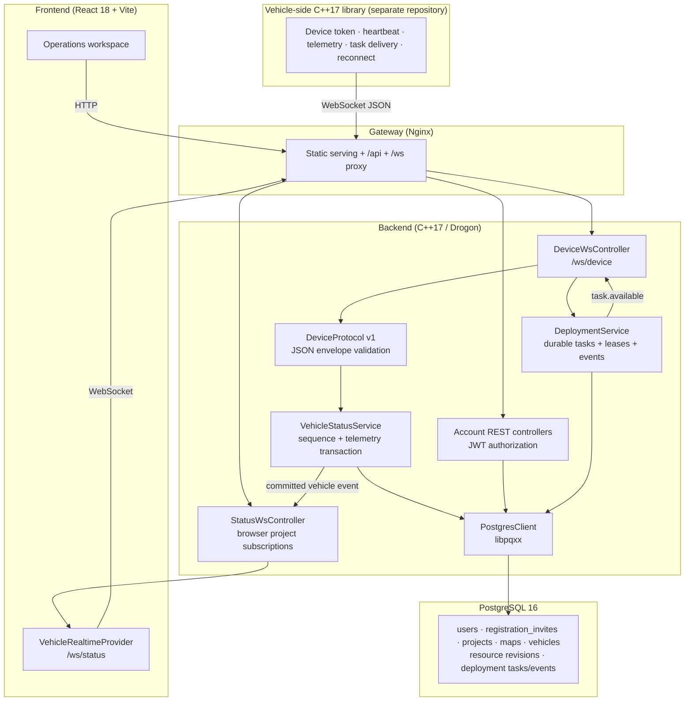

# ROC-SYSTEM

Robot Operation Control Platform — 机器人运营控制平台

**C++17 / Drogon REST + WebSocket 后端 · React 18 / TypeScript 前端 · PostgreSQL 数据层 · Docker Compose 部署**

## 架构总览



## 技术栈

| 层 | 技术 | 版本 | 用途 |
|---|---|---|---|
| 前端框架 | React + TypeScript | 18.3 / 5.9 | SPA 页面组件 |
| 构建工具 | Vite | 6.3.5 | 开发服务器 + 生产构建 |
| CSS | Tailwind CSS | v4 | 原子化样式 |
| UI 组件库 | shadcn/ui (Radix + Lucide) | — | 49 个可访问组件 |
| 图表 | Recharts | 2.15 | 性能监控图表 |
| 路由 | React Router DOM | v6 | 客户端路由 + 守卫 |
| 后端框架 | Drogon | v1 | 非阻塞 HTTP + WebSocket |
| 语言标准 | C++17 | — | 后端业务逻辑 |
| 数据库驱动 | libpqxx | v6 | PostgreSQL C++ 客户端 |
| JSON | jsoncpp | — | JSON 解析与序列化 |
| 加密 | OpenSSL | — | HMAC-SHA256 / SHA-256 |
| 数据库 | PostgreSQL | 16+ | 关系型数据库 |
| 容器化 | Docker + Compose | 3.9 | 三服务编排 |
| 网关 | Nginx | — | 静态服务 + 反向代理 |

## 项目结构

```
ROC-SYSTEM/
├── docker/
│   ├── backend/Dockerfile          # 多阶段 C++ 编译 (CMake + make)
│   ├── frontend/
│   │   ├── Dockerfile               # 多阶段 Node + Nginx 构建
│   │   └── nginx.conf               # SPA fallback + API/WS 代理
│   ├── postgres/Dockerfile          # PostgreSQL 运行镜像
│   └── compose/
│       ├── docker-compose.yml       # 开发/常规三服务编排
│       ├── docker-compose.release.yml # 运行机只加载已构建镜像
│       ├── .env.example             # 常规编排环境变量模板
│       └── release.env.example      # release 运行配置模板
├── postgres/
│   ├── init/init.sql                # 全新数据库完整 Schema
│   └── migrations/                  # 001–009 增量迁移
├── roc-backend/
│   ├── CMakeLists.txt               # C++17 · Drogon · libpqxx · OpenSSL · jsoncpp
│   ├── schemas/                     # OpenAPI 3.1 与三个 JSON Schema
│   ├── tests/                       # 协议、配置、图片、路网、邀请码及合同测试
│   └── src/
│       ├── main.cpp                 # 入口：配置加载 → 连接池 → 路由注册 → 启动
│       ├── config/
│       │   └── AppConfig.{h,cpp}    # HTTP/DB/JWT/设备/Origin 配置
│       ├── controllers/
│       │   ├── AuthController.{h,cpp}      # register · login · me · change-password · logout
│       │   ├── AdminController.{h,cpp}     # 用户、统计、角色与邀请码管理
│       │   ├── ProjectController.{h,cpp}   # 项目/地图 CRUD · 文件上传
│       │   ├── MapArtifactController.{h,cpp} # 地图原图不可变制品 API
│       │   ├── RoadNetworkController.{h,cpp} # 路网不可变版本 API
│       │   ├── VehicleController.{h,cpp}   # 车辆注册 · 状态更新 · 删除
│       │   ├── DeploymentController.{h,cpp} # 持久下发批次与设备任务 API
│       │   ├── StatusWsController.{h,cpp}  # 浏览器项目订阅 · 广播
│       │   └── DeviceWsController.{h,cpp}  # 设备鉴权 · 心跳 · 遥测
│       ├── middleware/
│       │   └── AuthMiddleware.{h,cpp}      # AuthFilter · SuperAdminFilter
│       ├── models/
│       │   └── User.h                      # 用户数据模型
│       ├── db/
│       │   ├── PostgresClient.{h,cpp}      # SQL 执行 (query/execute/insertReturning)
│       │   └── ConnectionPool.{h,cpp}      # 线程安全连接池 (4 连接)
│       ├── protocols/
│       │   ├── common/types.h              # RobotStatus 领域类型
│       │   └── DeviceProtocol.{h,cpp}       # JSON Device Protocol v1 编解码与校验
│       ├── services/
│       │   ├── DeploymentService.{h,cpp}    # 任务、租约、重试与事件流水
│       │   ├── RoadNetworkService.{h,cpp}   # road-network v1 强校验与规范化
│       │   └── VehicleStatusService.{h,cpp} # sequence 与车辆快照原子持久化
│       └── utils/
│           ├── JwtHelper.{h,cpp}           # JWT 签发与验证 (HMAC-SHA256)
│           ├── PasswordHash.{h,cpp}        # 密码哈希 (SHA-256 + 随机盐)
│           ├── InvitationCode.{h,cpp}      # 密码学随机一次性邀请码
│           └── AuditLogger.h               # 审计日志工具
├── roc-frontend/
│   ├── e2e/road-network-editor.spec.ts     # 画布与键盘 Playwright 测试
│   ├── index.html
│   ├── package.json                        # React 18 · shadcn/ui · Recharts · Lucide
│   ├── vite.config.ts                      # API 代理 + Tailwind v4
│   └── src/
│       ├── main.tsx                        # React 入口
│       ├── App.tsx                         # AuthContext · Router · ProtectedRoute · SuperAdminRoute
│       ├── app/                            # 认证、布局和实时状态 Provider
│       ├── shared/
│       │   ├── api/                        # 统一 client/config/errors
│       │   ├── styles/                     # Tailwind 入口与设计变量
│       │   └── ui/                         # 公共页面状态和格式化组件
│       ├── features/                       # 项目、地图、车辆、路网、下发和邀请码模型
│       ├── types/
│       │   └── robot.ts                    # Robot · RobotPosition · RobotVelocity · PathNode
│       ├── guidelines/
│       │   └── Guidelines.md               # 前端开发指南
│       └── components/
│           ├── Home/Login/Register/Profile # 公开入口和账户页面
│           ├── Projects/Project*           # 项目、地图、车辆和设置页面
│           ├── MapDetailPage.tsx           # 统一 SVG 地图与实时车辆
│           ├── RoadNetworkEditorPage.tsx   # 路网编辑器装配页
│           ├── road-network-editor/        # 画布、图层、工具栏、面板及控制器
│           ├── *DeployDialog.tsx           # 地图/路网批量下发
│           ├── InvitationCodesPanel.tsx    # 超级管理员邀请码管理
│           ├── ProtocolsPage.tsx           # 页面文档指南
│           ├── SuperAdminPage.tsx          # 平台账户与统计
│           └── ui/                         # shadcn/ui 基础组件
├── scripts/
│   ├── deploy-all-docker.sh                # 一键 Docker Compose 编排
│   ├── deploy-all.sh                       # 一键本地部署编排
│   ├── build-release-bundle.sh             # 构建机生成可转移的镜像交付包
│   ├── deploy-backend-docker.sh            # 后端 Docker 构建部署
│   ├── deploy-backend.sh                   # 后端本地部署
│   ├── deploy-frontend-docker.sh           # 前端 Docker 构建部署
│   ├── deploy-frontend.sh                  # 前端本地部署
│   ├── deploy-release-runtime.sh           # 交付包内的运行机部署脚本
│   ├── deploy-postgres-docker.sh           # PostgreSQL Docker 部署
│   ├── deploy-postgres.sh                  # PostgreSQL 本地部署
│   ├── deploy-gateway.sh                   # Nginx 网关部署
│   ├── verify-deployment.sh                # HTTP/API/DB/WebSocket 部署验收
│   ├── simulator/
│   │   ├── virtual_vehicle.py              # JSON v1 虚拟车辆与制品交付客户端
│   │   ├── virtual-vehicle.env.example     # 单车非敏感运行配置样例
│   │   ├── requirements.txt                # 独立 Python venv 依赖
│   │   └── roc-virtual-vehicle@.service    # 多实例 systemd 服务模板
│   ├── lib/common.sh                       # Shell 公共函数库
│   ├── config/
│   │   ├── deploy.env.example              # 部署环境变量模板
│   │   └── secrets.env.example             # 密钥模板
│   └── templates/
│       └── nginx-site.conf.template        # Nginx 站点配置模板
├── .gitignore
├── CHANGELOG.rst                           # 变更日志 (Keep a Changelog)
└── README.md                               # 本文件
```

## 模块调用关系

### HTTP 请求生命周期

```
Browser → Nginx (static or proxy)
  → Drogon HttpAppFramework
    → CORS Preflight? → pass through
    → Route Match: /api/auth/* /api/admin/* /api/projects/* /api/vehicles/*
    → Middleware (optional):
        AuthFilter          → JWT Bearer token 校验 → 注入 user_id/username/role 到 request attributes
        SuperAdminFilter    → JWT + role == "super_admin" 校验
    → Controller Handler (lambda)
        → PostgresClient (new connection or pool)
            → libpqxx → PostgreSQL
        → Response (JSON)
    → Client
```

**路由注册模式**：所有路由函数在 `main.cpp` 中以独立函数调用注册（非 Drogon 注解方式），格式为 `roc::controller::registerXxxRoutes(cfg, connStr)`。

### WebSocket 实时推送链

```
Vehicle C++17 client
  → GET /ws/device + Authorization: Device <per-vehicle token>
    → DeviceWsController maps token to vehicle identity
      → DeviceProtocol validates JSON v1 envelope and sequence
        → VehicleStatusService atomically persists heartbeat/telemetry + sequence
          → StatusWsController broadcasts only the committed vehicle snapshot
            → authenticated /ws/status project subscribers
              → VehicleRealtimeProvider merges versioned events
```

### JSON Device Protocol v1

- 车辆只通过 `/ws/device` 上报，不再轮询任务或调用旧协议 HTTP 入口。
- 每条消息包含 `protocol_version`、UUID `message_id`、`type`、十进制字符串 `sequence`、RFC 3339 `timestamp` 和对象 `payload`。
- 车辆身份只从 WebSocket 握手头 `Authorization: Device <token>` 映射；正文中的 `vehicle_id`/`robot_id` 会被拒绝。
- 当前上行类型为 `heartbeat` 和 `telemetry`。建议 30 秒心跳，45 秒无有效消息关闭连接；全局硬上限 64 KiB，heartbeat 最大 4 KiB，telemetry 最大 16 KiB。
- 最后设备 sequence 与遥测在同一数据库更新中提交；重复 sequence 返回幂等确认，不重复写入或广播。
- ROC 二进制、`/api/protocol/status`、`/api/protocol/command`、`/api/protocol/roc` 和 `/api/protocol/pending/{robot_id}` 已删除。
- 服务端通过此常连接发送 `task.available` 通知；耐久任务和大文件仍通过 HTTP(S) 接受和下载，不在 WebSocket 传输大文件。
- REST API 的 OpenAPI 3.1 合同位于 `roc-backend/schemas/openapi-v1.json`；设备通信、路网和下发任务的 JSON Schema 位于同目录的 `device-protocol-v1.schema.json`、`road-network-v1.schema.json` 与 `deployment-task-v1.schema.json`。路网保存接口只接受通过 v1 强校验的规范 JSON。
### 前端路由守卫

```
App.tsx → AuthContext (JWT token / role / username → localStorage)
  ├── / · /login · /register · /guide              → 公开路由
  ├── /profile · /projects · /protocols · …         → ProtectedRoute (isLoggedIn)
  └── /admin/users                                    → SuperAdminRoute (isLoggedIn + role=="super_admin")
```

## 数据流

### 认证流

```
Register
  → POST /api/auth/register { username, email, password, invitation_code }
    → 事务锁定一次性邀请码 → 创建 regular 账户 → 标记邀请码已使用
Login
  → POST /api/auth/login { username, password }
    → 密码哈希: SHA-256(password + 16-byte random salt)
    → JWT 签发: HMAC-SHA256(header.payload, JWT_SECRET)
    → 返回 { token, user: { user_id, username, role } }
  → 前端: localStorage 存储 roc_token / roc_role / roc_username
  → 后续请求: Authorization: Bearer <token>
  → 后端 AuthFilter: 验证 → 注入 user_id/username/role 到 request attributes
```

### 实时状态流

```
Vehicle opens /ws/device with a per-vehicle Device token
  → server derives vehicle identity from the token hash
    → heartbeat / telemetry JSON v1 message
      → protocol, field, size and monotonic sequence validation
        → database atomically updates snapshot + telemetry_version + device_last_sequence
          → project-scoped /ws/status event after commit
            → frontend merges by version; REST polling remains browser fallback
```
### 路网编辑与版本流

```
地图资源 → /projects/{pid}/maps/{mid}/edit
  → 选择 / 平移 / 新增节点 / 连边 / 删除
  → 前端结构校验 + 撤销/重做 + 未保存提示
  → POST road-network/revisions
    → 后端重新校验 schema、坐标模式、ID、引用、自环、重复边、限速与 10 MiB 上限
    → 节点/边按 ID 规范化排序 → SHA-256
    → road_network_revisions 追加不可变版本
  → 历史版本可读取为新草稿；再次保存始终产生新版本
```

监控页保持只读并读取地图的最新兼容快照；编辑器不会后台自动保存。只有已持久化版本才能在后续路网下发流程中作为资源引用。

### 路网版本下发流

```
已保存路网版本 → 编辑器“下发 vN”
  → 仅列出绑定当前地图的车辆，并显示在线状态、Device token 资格和已送达版本
  → 用户显式选择车辆 → 二次确认版本与目标数量
  → POST /api/projects/{pid}/deployments
    → 每辆车创建独立持久任务；离线车辆保持 queued（等待车辆上线）
  → 对话框每 3 秒使用批次 GET 接口读取权威状态
    → 展示已通知、已接单、下载中、交付处理中、已送达、失败、取消或过期
  → 可取消尚未进入最终交付阶段的任务；失败/取消/过期车辆可按原版本创建新批次重试
```

创建成功只代表“任务已创建”。只有车端经 Device token + 租约下载、校验并明确回报 `delivered`，界面才显示“已送达”；该状态不表示车辆已加载或应用路网。当前批次 ID 写入编辑页查询参数，浏览器刷新后可恢复逐车状态。存在未保存草稿时，下发入口禁用，避免草稿与不可变版本混淆。

### 地图制品上传与下发流

```
multipart/form-data 上传 PNG/JPEG 原图（name + image，最大 30 MiB；中文显示名/原始文件名使用安全英文传输名）
  → 后端校验真实文件签名与图片尺寸 → 临时文件原子移动
  → 同一事务创建 maps 记录和 map_artifacts v1
    → 记录 MIME、像素尺寸、字节数、SHA-256 与不可变存储键
  → 地图卡片“下发地图” → 选择项目车辆并二次确认
  → 复用持久部署批次、Device token、租约、manifest 和制品下载接口
  → 车端按 SHA-256 校验原始图片并保存或交给受控本地适配器
  → 仅在车端回报 delivered 后更新 delivered_map_artifact_id
```

旧地图可通过制品接口将当前受保护原图固化为 v1；同一 SHA-256 重复调用保持幂等。地图删除会同时清理未被引用的路网版本、制品元数据和文件；一旦版本进入部署历史或被车辆确认为已送达，删除返回 409，以免破坏审计链。平台不转码，也不声称车辆已加载或应用地图。

### 地图可视化 — 统一 SVG 坐标空间

```

容器尺寸 → ResizeObserver → 矩形 viewport
地图元数据 → worldToMap() → 图片像素坐标
fitScale + zoom + pan → 单一 SVG <g transform>
  ├── 鉴权加载的地图 <image>
  ├── road_network 路网 <line>
  └── 当前地图车辆标记与方向

交互:
  - 光标锚定缩放、pointer capture 平移、适应视图和专注模式
  - 桌面三栏显示车辆列表/地图/详情；窄屏使用车辆选择器和详情浮层
  - 选中状态保存 vehicle ID，详情持续从实时 store 派生
  - 路网导出为 CSV（from_x,from_y,to_x,to_y）
```

## 数据库 Schema


## API 端点

### 健康检查

| 端点 | Method | 认证 | 说明 |
|---|---|---|---|
| `/api/health` | GET | 公开 | 服务存活检查 |
| `/api/db/ping` | GET | 公开 | 数据库连接检查 |

### 认证 (Auth)

| 端点 | Method | 认证 | 说明 |
|---|---|---|---|
| `/api/auth/register` | POST | 邀请码 | 使用有效的一次性 5 位邀请码注册普通用户并返回 JWT |
| `/api/auth/login` | POST | 公开 | 用户登录，返回 JWT |
| `/api/auth/logout` | POST | 公开 | 登出 (客户端丢弃 token) |
| `/api/auth/me` | GET | Bearer | 获取当前用户信息 |
| `/api/auth/change-password` | POST | Bearer | 修改密码 |

### 管理 (Admin) — 需要 super_admin

| 端点 | Method | 认证 | 说明 |
|---|---|---|---|
| `/api/admin/users` | GET | super_admin | 用户列表 (分页/搜索/筛选) |
| `/api/admin/users/{id}` | GET | super_admin | 用户详情 |
| `/api/admin/users/{id}` | DELETE | super_admin | 删除用户 |
| `/api/admin/users/{id}/status` | PATCH | super_admin | 启用/停用用户 |
| `/api/admin/users/{id}/vehicles` | GET | super_admin | 用户的车辆列表 |
| `/api/admin/invitation-codes` | GET | super_admin | 按 `page`、`limit`、`status` 分页查看邀请码、总数及使用/撤销状态 |
| `/api/admin/invitation-codes` | POST | super_admin | 随机生成 5 位数字与大写字母一次性邀请码 |
| `/api/admin/invitation-codes/{id}` | DELETE | super_admin | 撤销尚未使用的邀请码 |
| `/api/admin/stats` | GET | super_admin | 系统统计数据 |

### 项目 (Projects)

| 端点 | Method | 认证 | 说明 |
|---|---|---|---|
| `/api/projects` | GET | Bearer | 用户项目列表 |
| `/api/projects` | POST | Bearer | 创建项目 |
| `/api/projects/{id}` | GET | Bearer | 项目详情 |
| `/api/projects/{id}` | PATCH | Bearer | 更新项目 |
| `/api/projects/{id}` | DELETE | Bearer | 无交付历史时解除车辆地图绑定并级联删除项目资源；有部署或车辆交付引用时返回 409 |
| `/api/projects/{id}/maps` | GET | Bearer | 已授权项目的地图列表 |
| `/api/projects/{pid}/maps/{mid}` | GET | Bearer | 读取单张地图及坐标元数据 |
| `/api/projects/{pid}/maps/{mid}/image` | GET | Bearer | 校验项目归属后读取地图图片；不提供匿名 `/static` 回退 |
| `/api/projects/{id}/maps/upload` | POST | Bearer | `multipart/form-data` 上传（`name` + `image`）；PNG/JPEG，最大 30 MiB，显示名支持中文，并自动创建不可变 v1 制品 |
| `/api/projects/{pid}/default-map` | PUT | Bearer | 原子设置项目默认地图 |
| `/api/projects/{pid}/maps/{mid}` | PATCH | Bearer | 更新地图信息 |
| `/api/projects/{pid}/maps/{mid}` | DELETE | Bearer | 删除无车辆绑定且无交付历史的地图，并清理未引用制品文件 |
| `/api/projects/{pid}/maps/{mid}/artifacts` | GET | Bearer | 列出不可变地图制品版本及当前版本 |
| `/api/projects/{pid}/maps/{mid}/artifacts` | POST | Bearer | 将旧地图当前原图幂等固化为不可变制品版本 |
| `/api/projects/{pid}/maps/{mid}/road-network/revisions` | GET | Bearer | 列出不可变路网版本及当前最新版本 |
| `/api/projects/{pid}/maps/{mid}/road-network/revisions` | POST | Bearer | 校验并创建新的不可变 road-network v1 版本 |
| `/api/projects/{pid}/maps/{mid}/road-network/revisions/{rid}` | GET | Bearer | 读取指定版本元数据和规范化路网正文 |

### 车辆 (Vehicles)

| 端点 | Method | 认证 | 说明 |
|---|---|---|---|
| `/api/vehicles?project_id={pid}` | GET | Bearer | 按已授权项目过滤车辆；无参数时返回当前主体可见车辆 |
| `/api/vehicles` | POST | Bearer | 注册车辆并校验项目/地图归属 |
| `/api/vehicles/{id}` | PATCH | Bearer | 更新车辆信息、状态/指标和项目地图绑定 |
| `/api/vehicles/{id}` | DELETE | Bearer | 删除车辆 |
| `/api/vehicles/{id}/device-token` | GET | Bearer | 查看设备凭据配置状态和尾号 |
| `/api/vehicles/{id}/device-token` | POST | Bearer | 生成或轮换单车凭据；明文仅返回一次 |
| `/api/vehicles/{id}/device-token` | DELETE | Bearer | 撤销单车凭据 |

### 设备通信 (JSON Device Protocol v1)

| 端点 | 协议 | 认证 | 说明 |
|---|---|---|---|
| `/ws/device` | WebSocket JSON | `Authorization: Device <token>` 握手头 | 单车心跳与完整遥测；身份由 token 映射，持久 sequence 去重，断线自动标记离线 |

设备上行消息使用统一 JSON envelope，当前接受 `heartbeat` 和 `telemetry`；单条最大 64 KiB。服务端 `hello` 返回车辆 ID、30 秒心跳建议、45 秒空闲超时、大小限制和已持久化的最后客户端 sequence。持久任务以服务端 `task.available` envelope 通知，车辆不轮询；旧 ROC、status、command 和 pending 接口均不再注册。

#### Python 虚拟车辆

`scripts/simulator/virtual_vehicle.py` 可用于 Demo 和接口联调。一个进程只模拟一辆已注册且已签发 Device token 的车辆：建立 `/ws/device`、根据服务端 `hello` 延续持久 sequence、周期发送心跳和运动遥测，并通过设备 HTTP 接口接受、校验和原子保存地图/路网制品。它不会轮询任务，也不会把 Device token、任务租约或授权头写入日志。

推荐在服务器使用独立 venv 和受限 systemd 用户运行。把 `virtual-vehicle.env.example` 复制到 `/etc/roc-virtual-vehicle/<实例>.env`，把明文 Device token 单独写入配置指定的 `0600/0640` 文件；状态和制品目录使用 `/var/lib/roc-virtual-vehicle/<实例>/`。当前同机 Demo 的 `ROC_SERVER_URL` 可设为 `http://127.0.0.1:3000`，生产切换到可信 HTTPS 域名后脚本会自动使用 WSS，并默认执行证书校验。

```bash
python3 -m venv /opt/roc-virtual-vehicle/.venv
/opt/roc-virtual-vehicle/.venv/bin/pip install -r scripts/simulator/requirements.txt

# 配置与 Device token 准备完毕后
systemctl enable --now roc-virtual-vehicle@vehicle-01
journalctl -u roc-virtual-vehicle@vehicle-01 -f
```

虚拟车完整下载 artifact 后会同时校验 manifest 字节数、MIME、响应 `X-Content-SHA256` 和本地 SHA-256。只有 `.part` 文件完成刷盘并原子改名后才回报 `delivered`；校验或磁盘写入失败只回报 `failed`。`delivered` 仍只表示文件已送达模拟车辆，不表示地图已加载或路网已执行。

### 持久设备任务 (Durable deployment tasks)

| 端点 | Method | 认证 | 说明 |
|---|---|---|---|
| `/api/projects/{project_id}/deployments` | POST | Bearer | 以不可变资源版本、目标车辆和幂等键创建逐车任务批次 |
| `/api/projects/{project_id}/deployments/{batch_id}` | GET | Bearer | 查询批次及逐车任务状态 |
| `/api/projects/{project_id}/deployments/{batch_id}/cancel` | POST | Bearer | 取消排队、已通知、已接受或下载中的任务 |
| `/api/device/tasks/{task_id}/accept` | POST | Device | 接受本车任务并取得 30 分钟租约；重复接受返回同一租约 |
| `/api/device/tasks/{task_id}/manifest` | GET | Device + `X-Task-Lease` | 获取资源版本、类型、大小、SHA-256 和下载地址 |
| `/api/device/tasks/{task_id}/artifact` | GET | Device + `X-Task-Lease` | 完整下载道路 JSON 或原始地图图片；不支持 Range，携带 Range 返回 416 |
| `/api/device/tasks/{task_id}/status` | POST | Device + `X-Task-Lease` | 以唯一 `event_id` 幂等回报下载、交付、完成或失败状态 |

任务主状态流为 `queued → offered → accepted → downloading → delivering → delivered`，活动状态也可进入 `failed`。车辆重连时服务端补发 `offered` 任务；租约超时会按阶段与尝试次数重新投递或失败。车端必须在完整下载后核对字节数、MIME 和 SHA-256；截断、类型或哈希不匹配时必须回报 `failed`，不得回报 `delivered`。`delivered` 仅表示车端已校验并保存/交给本地适配器，不表示车辆已加载或应用地图。机器可读契约位于 `roc-backend/schemas/deployment-task-v1.schema.json`。

### 浏览器实时通信 (WebSocket)

| 端点 | 协议 | 说明 |
|---|---|---|
| `/ws/status` | WebSocket JSON | 首帧发送 `{type:"authenticate",token:"<JWT>"}`，认证后以 `{type:"subscribe",project_id:"<UUID>"}` 订阅有权限的项目；断线自动重连并由 REST 轮询兜底 |

服务端连接后先发送 `hello`。浏览器须在 5 秒内完成账户 JWT 认证；认证后可发送 `subscribe`、`unsubscribe` 和 `ping`。订阅成功返回项目 `snapshot`，后续事件包括车辆事件、`deployment_created`、`deployment_updated`、`deployment_task_updated`、`pong` 和结构化 `error`。账户 JWT 与 Device token 不得互换。
## 部署架构

### Docker Compose 三服务拓扑

```
┌──────────────────────────────────────────────────────┐
│                   roc-net (bridge)                    │
│                                                      │
│  ┌──────────────┐  ┌──────────────┐  ┌───────────┐  │
│  │  postgres    │  │   backend    │  │ frontend  │  │
│  │  :5432       │  │   :8080      │  │  :80      │  │
│  │  health:     │  │   depends_on:│  │ depends_on:│  │
│  │   pg_isready │  │   postgres   │  │  backend   │  │
│  └──────────────┘  │   (healthy)  │  │  (healthy) │  │
│                    │  health:     │  │ health:    │  │
│                    │   /api/db/   │  │  proxy     │  │
│                    │   ping       │  │  /api/health│ │
│                    └──────────────┘                  │
└──────────────────────────────────────────────────────┘
          Port Mapping (host → container):
          postgres:  ${POSTGRES_DOCKER_HOST_PORT:-5432} → 5432
          backend:   ${BACKEND_DOCKER_HOST_PORT:-8080}  → 8080
          frontend:  ${FRONTEND_DOCKER_HOST_PORT:-3000} → 80
```

**网络隔离**: 三服务通过 `roc-net` bridge 网络内部互通，仅映射配置中明确启用的主机端口。`backend` 等待 PostgreSQL 健康后启动，`frontend` 再等待后端 `/api/db/ping` 通过；`postgres` 初始化脚本创建 schema，但不会创建带固定密码的默认管理员。

### 分离部署

支持独立部署场景：前端/后端/数据库可分布在不同服务器。后端通过 `deploy.env` 读取 `DB_HOST` 等数据库连接参数；前端保持浏览器同源 `/api` 与 `/ws`，Nginx 在启动时用 `FRONTEND_BACKEND_UPSTREAM` 选择后端上游。后端容器将 `BACKEND_MAP_VOLUME` 持久挂载到 `/app/static`，避免重建容器丢失地图原图。部署脚本同时兼容 `docker compose` 与 `docker-compose`，并在返回前等待容器健康。

后端到 PostgreSQL 使用原生 TCP/TLS，而不是 HTTPS。当前 Demo 可使用 `DB_SSLMODE=disable`；生产环境应优先使用数据库域名并配置 `DB_SSLMODE=verify-full` 与 `DB_SSLROOTCERT=/run/secrets/roc-db/root.crt`。如数据库要求双向 TLS，再同时配置 `DB_SSLCERT` 与 `DB_SSLKEY`。独立后端 Docker 部署把宿主机 `DB_SSL_CERT_DIR` 只读挂载到 `/run/secrets/roc-db`；Compose 部署则从 `docker/compose/certs/postgres/` 读取，真实证书不会提交到 Git。

数据库定时备份、云快照和恢复编排由部署平台负责，不包含在本仓库的一键脚本中。交付时至少应把 PostgreSQL 数据卷和后端 `MAP_STORAGE_DIR`（原始地图制品）纳入同一恢复点，并定期在目标环境验证可恢复性。

## 快速开始

### 环境要求

- Node.js 20+
- PostgreSQL 16+
- Docker & Docker Compose
- C++ 编译器 (GCC/Clang) + CMake 3.16+

### 开发/构建机 Docker Compose 部署

```bash
cp docker/compose/.env.example docker/compose/.env
# 编辑 .env 修改密码等配置
bash scripts/deploy-all-docker.sh --up
bash scripts/verify-deployment.sh
```

这一路径包含 Docker 镜像构建，只能在开发机或具备足够 CPU、内存和 Docker namespace 权限的构建机执行。资源受限的运行主机不得执行 `deploy-all-docker.sh --up`、`docker compose --build` 或 `docker build`。

`verify-deployment.sh` 默认验证本机对外地址；分离网关或公网域名可通过 `VERIFY_BASE_URL=https://example.com` 指定。它会检查首页、后端健康、数据库连通与 WebSocket Upgrade。

数据库迁移 `009_registration_invites.sql` 完成后，已有 `super_admin` 可在“平台账户 → 注册邀请码”生成一次性邀请码。全新空数据库仍不会创建固定管理员、口令或固定邀请码；数据库运维人员应临时插入一个自选的 5 位大写字母数字 bootstrap 邀请码（必须同时包含数字和字母），完成首个账户注册后把该账户提升为 `super_admin`。后续邀请码全部由后台生成，不要在仓库或部署脚本中保存 bootstrap 邀请码或初始管理员密码。

`v0.2.1-rc1` 已于 2026-09-24 完成主服务器人工验收：有效邀请码首次注册成功，同一邀请码重复使用被拒绝，已撤销邀请码被拒绝，验收临时账户随后已清理。该结果验证串行业务行为；两个并发注册请求争用同一码时最多一个成功，仍必须由数据库/API 集成测试单独覆盖。

```sql
-- 仅限全新空数据库首次引导；把占位符替换为临时随机码，不要提交该值。
INSERT INTO registration_invites (code) VALUES ('<5位数字字母码>');
-- 注册完成后精确提升目标账户：
UPDATE users SET role = 'super_admin' WHERE username = '<operator>';
```

### 构建机到运行主机的 release 交付

生产或资源受限主机采用“构建机产出、运行机加载”的两阶段流程。交付单位是包含三个已构建 Docker 镜像的 release bundle，不直接复制动态链接的后端二进制，也不把源码或编译工具带到运行主机。

在 Linux x86_64 构建机的已审批 commit/tag 检出上执行；完整版本必须与前端 `package.json` 一致，去掉预发布后缀的基础版本必须与后端 CMake 项目版本一致：

```bash
bash scripts/build-release-bundle.sh v0.2.1
# 中国大陆构建机可按需使用：
# APT_MIRROR=tsinghua NPM_MIRROR=npmmirror bash scripts/build-release-bundle.sh v0.2.1
```

构建脚本会在 Docker builder 中运行后端 CTest、前端 typecheck/生产构建、lint/Vitest 和 Playwright 画布/键盘门禁，然后生成：

```text
release-output/roc-system-v0.2.1-amd64.bundle.tar
release-output/roc-system-v0.2.1-amd64.bundle.tar.sha256
```

交付包同时包含版本化的 `migrations/` SQL，便于运行主机在切换应用容器前对现有数据库执行待应用迁移。将两个文件传到运行主机；传输方式可使用 SSH/SCP、内网对象存储或人工上传。运行主机只需要 Docker、Docker Compose v2、`tar`、`gzip` 和 `sha256sum`：

```bash
sha256sum -c roc-system-v0.2.1-amd64.bundle.tar.sha256
mkdir -p roc-system-v0.2.1
tar -xf roc-system-v0.2.1-amd64.bundle.tar -C roc-system-v0.2.1
cd roc-system-v0.2.1
bash deploy.sh --prepare
# 编辑 release.env，填写 DB_PASSWORD、JWT_SECRET、Origin 和端口
bash deploy.sh --install
```

`deploy.sh --install` 会校验运行主机 CPU 架构、内部镜像包和 manifest，执行 `docker load`，再以 `--no-build --pull never` 启动三个服务。release Compose 没有 `build:` 和源码挂载，因此不会在运行主机编译或访问镜像仓库。首次从旧 Compose 迁移时，如同名的 `roc-frontend`、`roc-backend`、`roc-postgres` 容器已存在，应先停止并移除这三个旧容器，但不要删除任何数据卷；后续 release 均使用固定项目名 `roc-system`，可直接滚动重建容器。

旧独立数据库脚本默认使用 `roc_postgres_data`，旧 Compose 默认使用 `roc_pgdata`。迁移前必须用 `docker volume ls` 和旧容器的 mount 信息确认实际卷名，再填写 `POSTGRES_DOCKER_VOLUME` 与 `BACKEND_MAP_VOLUME`。`REQUIRE_EXISTING_DATA_VOLUMES=true` 会在卷不存在时拒绝启动，防止误建空数据库；只有确认是全新安装时才改为 `false`。

构建包本身不包含数据库口令、JWT 密钥或证书；根目录 `.dockerignore` 也会阻止本地环境文件、私钥、构建结果和测试报告进入 Docker 构建上下文。release 构建默认拒绝存在未提交变更的工作区，并把精确 Git commit 写入 manifest。`release.env` 只在运行主机创建，并应保持 `0600` 权限。数据库备份继续由云服务器快照/备份服务负责，至少覆盖配置的 PostgreSQL 数据卷和地图制品卷。

### 前端开发

```bash
cd roc-frontend
corepack enable
pnpm install --frozen-lockfile
pnpm run dev     # http://localhost:3000
```

### 后端开发

```bash
cd roc-backend && mkdir build && cd build
cmake .. && make
BACKEND_LISTEN_PORT=8080 DB_HOST=127.0.0.1 JWT_SECRET=my-secret \
  MAP_STORAGE_DIR=./static/maps ./roc-backend-server
```

## 验证与发布门禁

当前代码基线包含 6 个 CTest 后端测试、45 个 Vitest 前端单元/组件测试和 2 个 Playwright 画布/键盘测试。组件测试覆盖登录提交与错误映射、注册表单校验、邀请码规范化/失败状态、邀请码服务端分页交互、地图中文文件名/30 MiB 边界，以及通用错误态重试。发布前至少执行：

```bash
# 后端（Linux 构建主机）
cmake -S roc-backend -B roc-backend/build
cmake --build roc-backend/build --parallel
ctest --test-dir roc-backend/build --output-on-failure

# 前端
cd roc-frontend
corepack pnpm install --frozen-lockfile
corepack pnpm run typecheck
corepack pnpm run lint
corepack pnpm test
corepack pnpm run build
corepack pnpm run test:e2e
```

API 合同测试会校验 OpenAPI 与三份 JSON Schema，并确认 47 个 REST 操作的路由、认证和唯一 `operationId`。邀请码的有效注册、重复使用拒绝和撤销后拒绝已完成人工验收，登录、注册、邀请码和错误态组件测试也已通过；两个并发注册请求争用同一码时最多一个成功，仍需数据库/API 自动化。目标主机还应运行全链路 API、断线重连/租约恢复与交付异常冒烟测试。如果云测试机本身是非特权容器，嵌套 Docker 构建可能因 `unshare: operation not permitted` 被宿主机禁止；这项必须在支持 Docker namespace 的独立构建机或 CI 上完成。

## 用户角色

| 功能 | regular | super_admin |
|---|---|---|
| 登录/注册/修改密码 | ✓ | ✓ |
| 项目管理/地图/车辆 | ✓ | ✓ |
| 地图上传/路网编辑 | ✓ | ✓ |
| 性能监控 | ✓ | ✓ |
| 协议文档查看 | ✓ | ✓ |
| 管理用户 (CRUD/启停) | ✗ | ✓ |
| 系统统计 | ✗ | ✓ |
